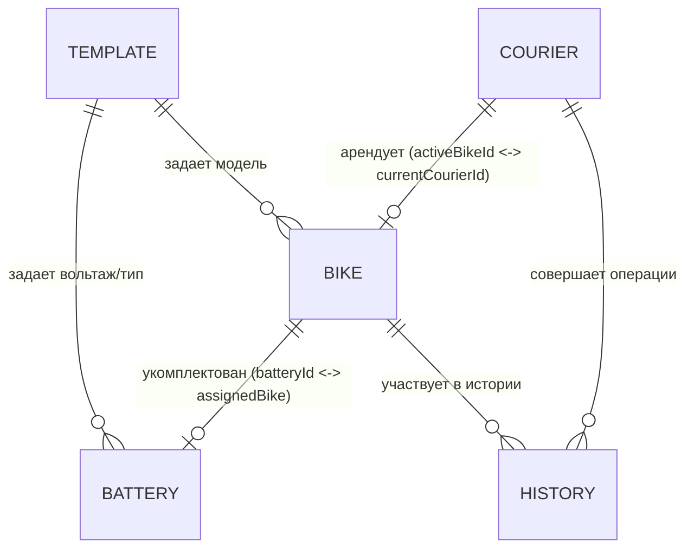

# 🏛️ СИСТЕМНАЯ АРХИТЕКТУРА И ГРАФ СВЯЗЕЙ: ONLY U2 PRO CRM
> **СТАТУС ДОКУМЕНТА:** Живой архитектурный контракт (Living Architecture Document).  
> **ОБЯЗАТЕЛЬНОЕ ПРАВИЛО ДЛЯ ИИ-АССИСТЕНТА:** Перед разработкой ЛЮБОЙ новой фичи — **прочитать этот документ целиком**. Ни одна новая функция не должна создаваться изолированно. После реализации любой новой фичи — **обязательно обновить этот документ**, внеся новую сущность/логику и её связи со всей системой.

---

## 1. ОБЩИЙ ОБЗОР ПРОДУКТА И ТЕХСТЕКА

* **Продукт:** CRM-система оперативного учета аренды электровелосипедов курьерами доставки.
* **Бизнес-фокус:** Учет парка байков, учет отдельного пула сменных аккумуляторов (АКБ), учет баланса/залогов курьеров, контроль сроков аренды и пресечение просрочек.
* **Фронтенд:** Чистый нативный JavaScript (ES6+), Tailwind CSS (CDN), библиотека иконок Phosphor Icons. Архитектура Single-Page Application (SPA) с сохранением вкладок через URL Hash (`#dashboard`, `#fleet`, `#batteries`, `#couriers`, `#history`).
* **Бэкенд:** Node.js Express (`server.js`) — API-маршруты и раздача статики.
* **Отказоустойчивость (Storage):** Клиент-авторитарная база данных (`LocalStorage` с ключом `only_u2_pro_crm_storage_v3`). Гарантирует 100% сохранение изменений на Vercel Serverless при любых перезагрузках контейнеров.

---

## 2. МОДЕЛЬ ДАННЫХ И СВЯЗИ СУЩНОСТЕЙ (ENTITY RELATIONSHIPS)



### 2.1. Велосипеды (`state.bikes[]`)
* `id` (String): Уникальный ID байка (напр. `"MB-101"`).
* `model` (String): Название модели (берется из `state.templates.bikeModels`).
* `frameNumber` (String): Номер рамы / VIN.
* `mileageKm` (Number): Пробег в км.
* `status` (String): Текущий статус — `'available'` (свободен на складе), `'in_rent'` (в аренде на линии), `'service'` (в ремонте/ТО).
* `batteryId` (String|null): Внешний ключ (FK) на привязанный аккумулятор из `state.batteries[].id`.
* `currentCourierId` (String|null): Внешний ключ (FK) на курьера-арендатора из `state.couriers[].id`.
* `rentalStart` (String|null): Дата начала аренды в формате `YYYY-MM-DD`.
* `rentalEnd` (String|null): Дата окончания аренды в формате `YYYY-MM-DD`.
* `condition` (String): Описание техсостояния («Отличное», «Замена колодок»).
* `location` (String): Физическое место («Склад», «На линии», «Мастерская»).

### 2.2. Аккумуляторы (`state.batteries[]`)
* `id` (String): Уникальный ID АКБ (напр. `"BAT-01"`).
* `model` (String): Маркировка батареи.
* `type` (String): Тип/емкость (напр. `"60V 21Ah"`, из `state.templates.batteryTypes`).
* `status` (String): `'available'` (свободен на складе, готов к выдаче), `'in_use'` (установлен на байке курьера).
* `assignedBike` (String|null): Двусторонняя связь — ID байка, на котором установлена АКБ.
* `notes` (String): Заметки о состоянии/зарядке.

### 2.3. Курьеры (`state.couriers[]`)
* `id` (String): Уникальный ID курьера (напр. `"C-01"`).
* `fullName` (String): ФИО курьера.
* `phone` (String): Телефон курьера.
* `passportNumber` (String): Номер паспорта / РВП / патента.
* `deposit` (Number): Внесенный залог в рублях (напр. `5000`).
* `debt` (Number): Текущая финансовая задолженность в рублях (если `debt > 0` — курьер должник).
* `balance` (Number): Авансовый остаток.
* `rating` (Number): Числовой рейтинг надежности от `1` до `5` (строго целое число без подписей).
* `activeBikeId` (String|null): Двусторонняя связь — ID текущего арендованного байка.
* `status` (String): `'active'` (на линии с байком), `'waiting'` (без байка), `'debtor'` (есть долг).
* `notes` (String): Заметки администратора.

### 2.4. Шаблоны (`state.templates`)
* `bikeModels` (Array of String): Список доступных моделей для выпадающих списков.
* `batteryTypes` (Array of String): Список доступных типов АКБ.
* *Связь:* Редактируются через `templateManagerModal`. При добавлении/удалении шаблона автоматически обновляются селекты в модалках добавления и редактирования.

### 2.5. История операций (`state.history[]`)
* `id` (String): `"H-..."` с таймстемпом.
* `timestamp` (String): Время операции (формируется через `getCurrentDate()`).
* `type` (String): `'checkout'` (выдача), `'checkin'` (возврат), `'payment'` (оплата), `'service'` (сервис).
* `courierName`, `bikeId`, `batteryId`, `amount`, `description`.

---

## 3. МАТРИЦА СВЯЗАННОСТИ И БИЗНЕС-ПРАВИЛА (BUSINESS LOGIC & INVARIANTS)

### 3.1. Выдача байка курьеру (`handleCheckout`)
1. **Байк:** `status = 'in_rent'`, `currentCourierId = courier.id`, `rentalStart = today`, `rentalEnd = today + days`, `location = 'На линии'`.
2. **Батарея:** Если выбрана АКБ — `battery.status = 'in_use'`, `battery.assignedBike = bike.id`.
3. **Курьер:** `courier.activeBikeId = bike.id`, `courier.status = 'active'`, увеличение `courier.deposit` на сумму залога.
4. **Сайд-эффекты:** Создание записи в `history`, `saveLocalDatabase()`, `updateBadges()`, `renderCurrentTab()`.

### 3.2. Прием байка на склад (`handleCheckin`)
1. **Байк:** `status = 'available'`, `currentCourierId = null`, `rentalStart = null`, `rentalEnd = null`, `location = 'Склад'`.
2. **Батарея:** `battery.status = 'available'`, `battery.assignedBike = null`.
3. **Курьер:** `courier.activeBikeId = null`, `courier.status = (courier.debt > 0 ? 'debtor' : 'waiting')`. Опциональный возврат залога (обнуление `courier.deposit`).
4. **Сайд-эффекты:** Запись в `history`, `saveLocalDatabase()`, `updateBadges()`, `renderCurrentTab()`.

### 3.3. Удаление сущностей (Каскадная безопасность)
* **При удалении байка:** Если байк был в аренде — у курьера сбрасывается `activeBikeId = null`. Если на байке была батарея — у батареи сбрасывается `assignedBike = null`, `status = 'available'`.
* **При удалении батареи:** Если батарея была привязана к байку — у байка сбрасывается `batteryId = null`.
* **При удалении курьера:** Если за курьером числился байк — байк возвращается на склад (`status = 'available'`). Плашка просрочки удаленного курьера мгновенно исчезает!

### 3.4. Определение просрочек и должников (Overdue Detection)
Курьер считается **проблемным / просрочившим** в двух случаях:
1. `courier.debt > 0` (прямая задолженность по балансу).
2. `bike.rentalEnd < getCurrentDate()` (срок аренды истек, а байк не сдан).
* **Последствия просрочки:**
  * Загорается 🔴 **красная плашка в меню Курьеров**.
  * Появляется карточка внимания на Дашборде с кнопкой *«Принять оплату / Продлить»*.
  * В таблице активных аренд строка подсвечивается красным и выводится: `до YYYY-MM-DD (-N дн.)` и бейдж `Просрочено (N дн.)`.
  * На карточке байка в Велопарке блок курьера окрашивается в красный с пометкой `ПРОСРОЧЕНО`.

---

## 4. ЕДИНЫЙ ЦВЕТОВОЙ СТАНДАРТ (DESIGN SYSTEM & COLOR MATRIX)

Во всей CRM цвета строго унифицированы:
* 🟢 **Изумрудный (`emerald`):** **СВОБОДЕН / НА СКЛАДЕ / ГОТОВ К ВЫДАЧЕ**.
  * 1-я плашка Велопарка (свободные байки).
  * 1-я плашка Наличия АКБ (свободные батареи на складе).
  * Бейдж «Свободен» на карточке байка и «Свободен (на складе)» на батарее.
  * Виджет «АКБ на складе (В наличии)» на дашборде.
* 🔵 **Синий (`blue`):** **В АРЕНДЕ / НА ЛИНИИ / В РАБОТЕ**.
  * 2-я плашка Велопарка (байки в аренде).
  * 2-я плашка Наличия АКБ (батареи в работе).
  * 1-я плашка Курьеров (активные курьеры, катающиеся прямо сейчас).
  * Блок курьера на карточке байка.
  * Виджет «Байков на линии» на дашборде.
* 🟠 **Оранжевый / Янтарный (`amber`):** **СЕРВИС / РЕМОНТ / ТО**.
  * 3-я плашка Велопарка (байки на ТО).
  * Бейдж «На ремонте/ТО» на карточке байка.
* 🔴 **Красный / Розовый (`rose`):** **ДОЛГ / ПРОСРОЧКА / ВНИМАНИЕ**.
  * 2-я плашка Курьеров (просрочившие аренду / должники).
  * Плашки долга в таблицах и блоках внимания.
* **Правило нулевых значений:** Число `0` в плашках бокового меню **никогда не отображается**. Если показатель равен 0 — плашка скрыта.

---

## 5. СИСТЕМА ВРЕМЕНИ (TIME ENGINE)

* **Единая точка входа времени:** Все операции используют функцию `getCurrentDate()`, а не нативный `new Date()`.
* **Симулятор времени (`#testTimeBar`):**
  * Позволяет смещать время вперед (`+1д`, `+3д`, `+7д`) или устанавливать точную дату для тестирования смены статусов и начисления просрочек.
  * Смещение хранится в `localStorage` под ключом `crm_test_time_offset_ms`.
  * При изменении времени вызывается `applySimulatedTimeChange()`, который мгновенно пересчитывает бейджи, перерисовывает таблицы и обновляет дату в шапке.

---

## 6. ОБЯЗАТЕЛЬНЫЙ РЕАКТИВНЫЙ КОНВЕЙЕР (MUTATION PIPELINE)

Каждая функция, изменяющая состояние (добавление, редактирование, удаление, сдача, прием, оплата, смена времени), **ОБЯЗАНА** выполнять 4 шага:

```javascript
// 1. Моментальное сохранение в localStorage браузера
saveLocalDatabase();

// 2. Реактивный пересчет цветных бейджей бокового меню со скрытием нулей
updateBadges();

// 3. Перерисовка текущей активной вкладки
renderCurrentTab();

// 4. Фоновая синхронизация с сервером Node.js (fire-and-forget)
fetch('/api/...', { method: 'POST', ... }).catch(() => {});
```

---

## 7. ПРОТОКОЛ ДЛЯ ИИ: КАК ВНЕДРЯТЬ НОВЫЕ ФИЧИ

При получении запроса на новую фичу ИИ-ассистент обязан задать себе следующие контрольные вопросы:

1. **Взаимосвязь с байками:** Влияет ли фича на статус байка (`available`, `in_rent`, `service`) или его местоположение?
2. **Взаимосвязь с АКБ:** Требуется ли привязка батареи, смена её статуса или проверка совместимости вольтажа?
3. **Взаимосвязь с курьерами:** Изменяет ли фича баланс, залог, статус должника (`debt`) или привязку байка?
4. **Взаимосвязь с меню (Бейджи):** Должна ли фича повлиять на счетчики в сайдбаре? Соблюден ли цветовой стандарт (зеленый/синий/оранжевый/красный)? Скрываются ли нули?
5. **Взаимосвязь со временем:** Учитывает ли фича `getCurrentDate()`? Как поведет себя при симуляции перемотки на 7 дней вперед?
6. **Взаимосвязь с историей:** Требуется ли логирование действия в журнал операций `state.history`?
7. **ОБЯЗАТЕЛЬНОЕ ОБНОВЛЕНИЕ ЭТОГО ДОКУМЕНТА:** После написания кода — внести изменения в соответствующий раздел `ARCHITECTURE.md`!
